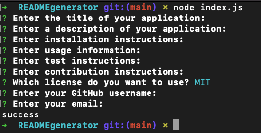

# README
  
  ## Description
  This application uses Javascript, NPM, and Inquirer to automate the process of creating a README file for applications. 
  ## Table of Contents
  - [Installation](#installation)
  - [Usage](#usage)
  - [Questions](#questions)
  - [License](#license)
  - [Contribution](#contribution)
  - [Tests](#tests)
  ## Installation
  In order to install this application you must clone the repository then install NPM and Inquirer.  In order to create the README, navigate into the cloned repository using your terminal, then type "node index.js" to start the application.  Then follow the prompts to create your README.
  ## Usage
  See the screenshot below for a example of the application prompts.
    
  See the walkthrough video for an actual step by step of the application.
  
  ## Questions
  https://github.com/ctolnai

  Please email me at christolnai@gmail.com for any questions.
  ## License
  This application is licensed under MIT
  ## How to Contribute
  This application follows the Contributor Covenant Code of Conduct
  ## Tests
  This application currently does not have any test instructions.